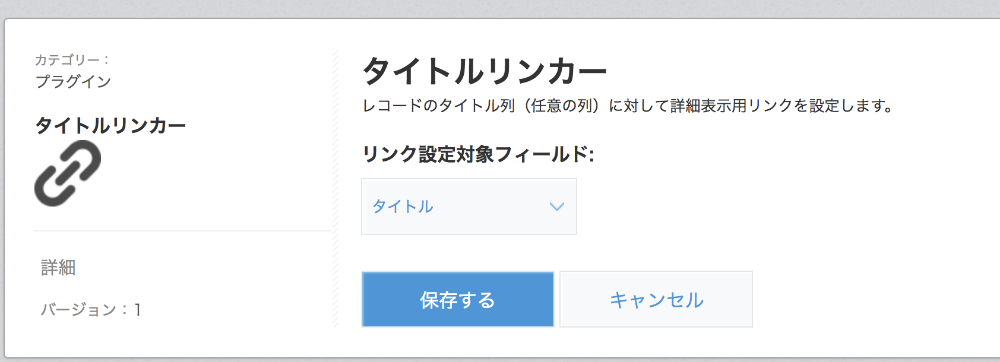
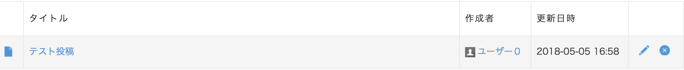
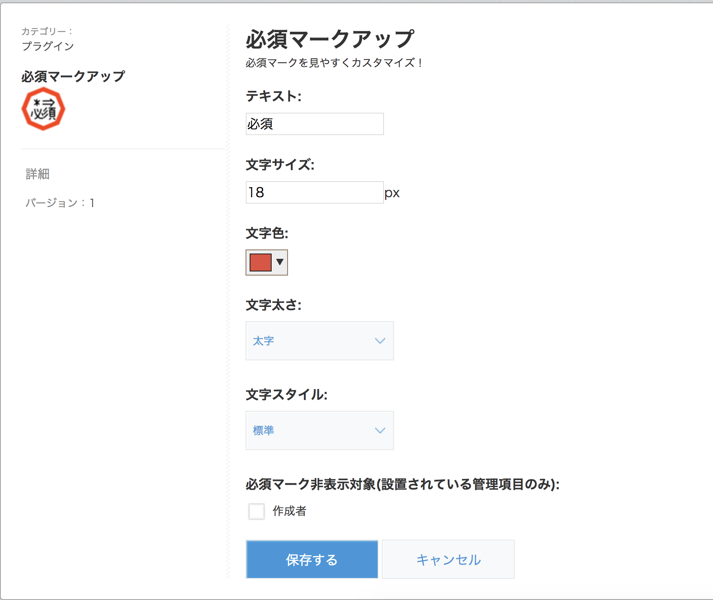
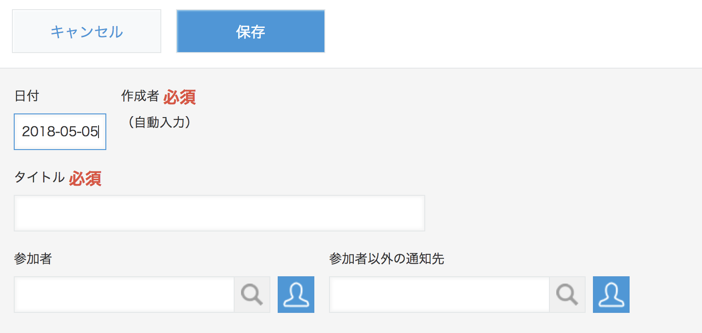

kintoneプラグイン
======================
kintoneプラグインのビルド済みファイルを公開しています。  
昨日説明など不足しているものが多数ですが、無償ファイルのものなので気軽におためしください。  
  
  
タイトルリンカー
----------
一覧画面で任意の列に、詳細画面へのリンクを設定することができます。  
[ダウンロード | ver.1](plugin/kintone-plugin-titlelinker-v1.zip)  
  
■設定画面

■一覧画面

  
  
必須マークアップ
----------
必須マークを見やすく／わかりやすく！  
フォントサイズや文字列そのものを自由にカスタマイズすることができます。  
[ダウンロード | ver.1](plugin/kintone-plugin-requiremaker-v1.zip)  
  
■設定画面

■編集画面
